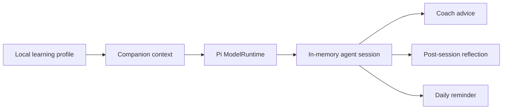

<p align="center">
  
</p>

<h1 align="center">PanwithU</h1>

<p align="center">
  <strong>English</strong> ·
  <a href="docs/README_ZH_CN.md">简体中文</a>
</p>

<p align="center">
  <strong>A terminal-first English learning companion powered by Pi Agent.</strong><br />
  在终端里练英语，和你的智能伙伴一起成长。
</p>

<p align="center">
  <a href="https://www.npmjs.com/package/panwithu"></a>
  <a href="https://www.npmjs.com/package/panwithu"></a>
  
  <a href="LICENSE"></a>
</p>

PanwithU turns vocabulary practice into an ongoing relationship with a local,
persistent companion. It combines a keyboard-focused terminal UI, spaced
review, pronunciation, pet growth, and a Pi-powered learning coach in one CLI.

## Quick start

```bash
npm install -g panwithu@latest
PWU
```

The first launch lets you choose a language, pronunciation, companion, and an
optional invitation code. Without a code, the core learning experience remains
available offline.

## Why PanwithU

| Capability         | What it means                                                                                        |
| ------------------ | ---------------------------------------------------------------------------------------------------- |
| Terminal-first     | Practice, navigate dictionaries, and manage progress without leaving the keyboard.                   |
| Local-first        | Your profile, review schedule, pet state, and cached audio stay on your computer.                    |
| Learning companion | 25 companions grow through study sessions, streaks, feeding, play, and accessories.                  |
| Adaptive review    | Due and failed words are prioritized before unseen vocabulary.                                       |
| Pi-powered coach   | Recent learning history and companion identity become contextual coaching, summaries, and reminders. |
| Cross-platform     | Runs on Linux, macOS, and Windows, including native daily reminders and speech fallbacks.            |

## Pi Agent design

PanwithU uses the
[Pi coding agent SDK](https://github.com/earendil-works/pi) as its agent
runtime—not as a generic chatbot bolted onto the interface.



The runtime registers the PanwithU learning provider, selects the configured
model, creates an isolated agent session, and streams the response back into
the TUI. The prompt includes concrete learning signals—recent sessions,
accuracy, streaks, and companion identity—so advice stays personal and tied to
actual progress.

The current agent is deliberately bounded: sessions are short-lived and tool
use is disabled. The learning record remains the source of truth on the local
device. Future versions can add explicit learning tools and persistent agent
memory without weakening that local-first boundary.

## CLI

```text
PWU                     Open the interactive terminal UI
PWU learn [count]       Practice vocabulary
PWU pet                 Visit your companion
PWU feed                Feed your companion
PWU play                Play together
PWU todo                View the learning plan
PWU reminder install 19 Enable the daily reminder
PWU summary             Generate a learning summary
PWU status              Show progress
PWU config              Run setup again
```

Inside the TUI, use `/dict`, `/chapter`, and `/mode` to shape a session;
`/coach` asks the Pi-powered companion for advice.

See the
[complete CLI guide](https://github.com/Pan-Binghong/PanWithU/blob/master/docs/PANWITHU_CLI.md)
for installation details, commands, storage paths, pronunciation behavior, and
development instructions.

## Local data and privacy

```text
~/.config/panwithu/config.json
~/.local/share/panwithu/profile.json
~/.local/share/panwithu/audio/
```

There is no PanwithU account system. Core progress is stored locally. Network
access is used only for dictionary audio and optional AI/TTS features; generated
audio is cached locally.

## Development

```bash
yarn install
yarn cli
yarn test:cli
yarn build
```

The CLI entrypoint is `bin/pwu.mjs`; the terminal application and learning
modules live under `cli/`.

## Open-source lineage

PanwithU is independently developed by Pan Binghong as a derivative of
[Qwerty Learner](https://github.com/RealKai42/qwerty-learner). PanwithU keeps
the original vocabulary and keyboard-learning foundation while making the CLI,
the persistent companion, local-first progress, and Pi Agent integration its
primary product experience.

The original project history and copyright notices remain in this repository.
Its previous README is preserved in
[Qwerty Learner project notes](https://github.com/Pan-Binghong/PanWithU/blob/master/docs/QWERTY_LEARNER.md).
Both the original work and this derivative are distributed under the GNU
General Public License v3.0.

## License

[GNU General Public License v3.0](LICENSE)
