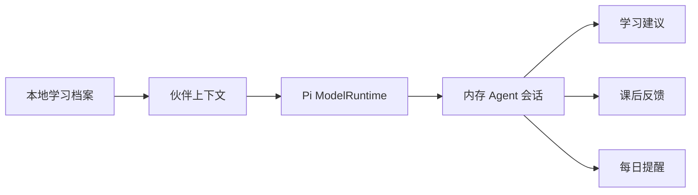

<p align="center">
  
</p>

<h1 align="center">PanwithU</h1>

<p align="center">
  <a href="https://github.com/Pan-Binghong/PanWithU/blob/master/README.md">English</a> ·
  <strong>简体中文</strong>
</p>

<p align="center">
  <strong>由 Pi Agent 驱动的终端优先英语学习伙伴。</strong><br />
  在终端里练英语，和你的智能伙伴一起成长。
</p>

<p align="center">
  <a href="https://www.npmjs.com/package/panwithu"></a>
  <a href="https://www.npmjs.com/package/panwithu"></a>
  
  <a href="../LICENSE"></a>
</p>

PanwithU 把单词练习变成一段与本地持久化伙伴共同成长的旅程。它在一个
CLI 中结合了键盘优先的终端界面、间隔复习、单词发音、宠物成长，以及由
Pi 驱动的学习教练。

## 快速开始

```bash
npm install -g panwithu@latest
pwu
```

同时支持完整名称命令 `panwithu`。在 Windows 和默认 macOS 等大小写不敏感的
系统中，输入 `PWU` 也会解析到同一个命令。Linux 用户如果偏好大写，可以在
Shell 配置中添加 `alias PWU=pwu`。

首次启动时，你可以选择界面语言和英语发音，并按需填写邀请码；状态符号伙伴可以随时改名。
即使不填写邀请码，核心学习功能也可以离线使用。

## 为什么选择 PanwithU

| 能力        | 具体含义                                                   |
| ----------- | ---------------------------------------------------------- |
| 终端优先    | 无需离开键盘即可练习、切换词典并管理学习进度。             |
| 本地优先    | 学习档案、复习计划、宠物状态和音频缓存保存在本机。         |
| 学习伙伴    | 小巧的状态符号 Agent 会响应学习、身体需求、提醒和玩耍。    |
| 自适应复习  | 到期单词和答错单词会排在新词之前。                         |
| Pi 学习教练 | 根据近期学习记录和伙伴身份生成建议、总结与每日提醒。       |
| 跨平台      | 支持 Linux、macOS 和 Windows，包括系统提醒与语音降级方案。 |

## Pi Agent 设计

PanwithU 使用
[Pi coding agent SDK](https://github.com/earendil-works/pi)
作为 Agent 运行时，而不是在界面旁边简单附加一个通用聊天机器人。



运行时会注册 PanwithU 学习服务、选择配置模型、创建隔离的 Agent 会话，
并把流式响应送回 TUI。Prompt 会包含近期学习次数、正确率、连续记录和伙伴
身份等具体信号，因此建议能够与真实学习进度关联。

当前 Agent 被有意限制在清晰边界内：会话是短生命周期的，并且禁用了工具
调用。学习记录仍以本地设备上的数据为准。未来可以在不破坏本地优先原则的
前提下，增加明确的学习工具和持久化 Agent 记忆。

## CLI 命令

```text
pwu                     打开交互式终端界面
pwu learn [count]       练习单词
pwu pet                 查看学习伙伴
pwu feed                喂养伙伴
pwu play                和伙伴玩耍
pwu todo                查看学习计划
pwu reminder install 19 开启每日提醒
pwu summary             生成学习总结
pwu status              查看学习进度
pwu config              重新运行设置
```

在 TUI 中可以使用 `/dict`、`/chapter` 和 `/mode` 设置学习内容；使用
`/coach` 向由 Pi 驱动的学习伙伴寻求建议。

完整的安装说明、命令、存储路径、发音逻辑和开发方式请参阅
[CLI 使用指南](https://github.com/Pan-Binghong/PanWithU/blob/master/docs/PANWITHU_CLI.md)。

## 本地数据与隐私

```text
~/.config/panwithu/config.json
~/.local/share/panwithu/profile.json
~/.local/share/panwithu/audio/
```

PanwithU 没有账户系统，核心学习进度保存在本机。只有词典发音和可选的
AI/TTS 功能会访问网络；生成的音频会缓存在本地。

## 开发

```bash
yarn install
yarn cli
yarn test:cli
yarn build
```

CLI 入口是 `bin/pwu.mjs`，终端应用和学习模块位于 `cli/` 目录。

## 开源关系与归属

PanwithU 由 Pan Binghong 独立开发，是
[Qwerty Learner](https://github.com/RealKai42/qwerty-learner)
的二次开发项目。PanwithU 保留了原项目的词库和键盘学习基础，同时将 CLI、
持久化学习伙伴、本地学习进度和 Pi Agent 集成作为主要产品体验。

原项目历史和版权声明仍保留在本仓库中。此前的 README 已归档在
[Qwerty Learner 项目说明](https://github.com/Pan-Binghong/PanWithU/blob/master/docs/QWERTY_LEARNER.md)。
原项目与本二次开发项目均采用 GNU General Public License v3.0。

## 许可证

[GNU General Public License v3.0](../LICENSE)
